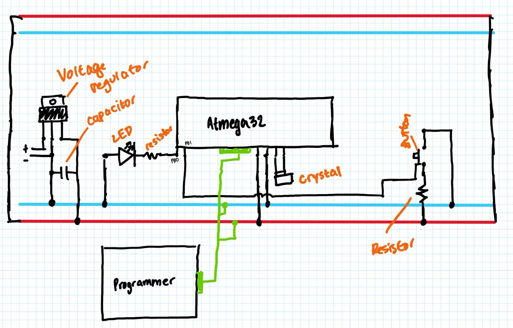

# Embedded Blink Program with ATMEGA32

## Overview
This project is a simple demonstration of a blink program running on an ATMEGA32 microcontroller. The program toggles an LED connected to pin PB0 of the ATMEGA32 at regular intervals, when the push button at pin PB1 is pressed.

## Hardware Requirements
- ATMEGA32 microcontroller
- LED
- Push button
- Resistors (for LED current limiting and pull-up resistor for the push button)
- AVR ISP Programmer
- Wires
- Breadboard
- 8MHz external crystal
- Capacitor
- 9V battery with a voltage regulator to output 5V (for powering the circuit)

## Hand-Drawn Schematic

